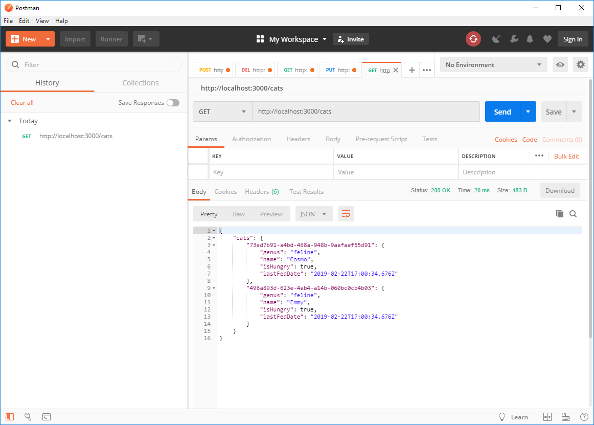
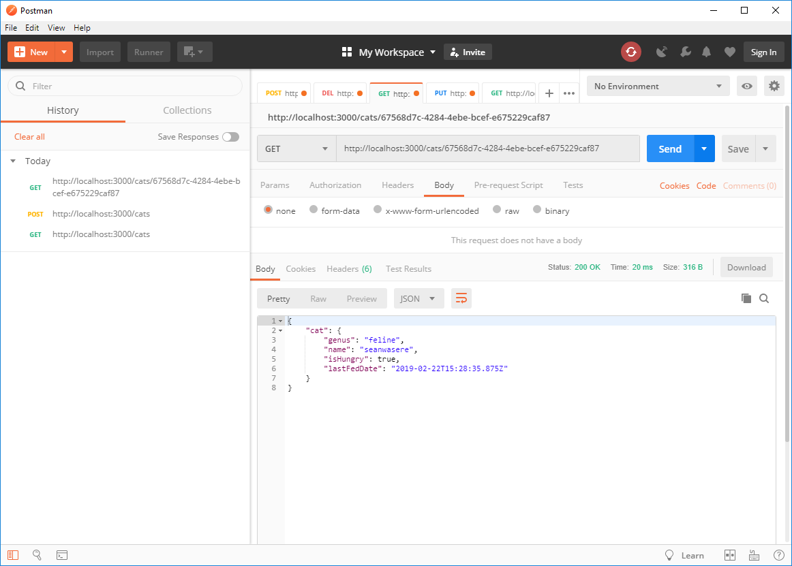
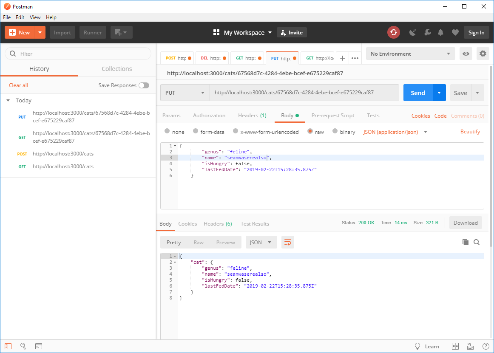

## Seans-TypeScript-NodeJS-CRUD-REST-API-Boilerplate 

### Setup

```bash
npm install
```

### Development with nodemon and tsc --watch

```bash
npm run dev
```

Then visit `http://localhost:3000/cats`

### Run without nodemon and tsc --watch

```bash
npm start
```

Then visit `http://localhost:3000/cats`


## Usage

### List all records



### Post (Create) Record


### Get by Id



### Put (Update) Record



### Delete Record

