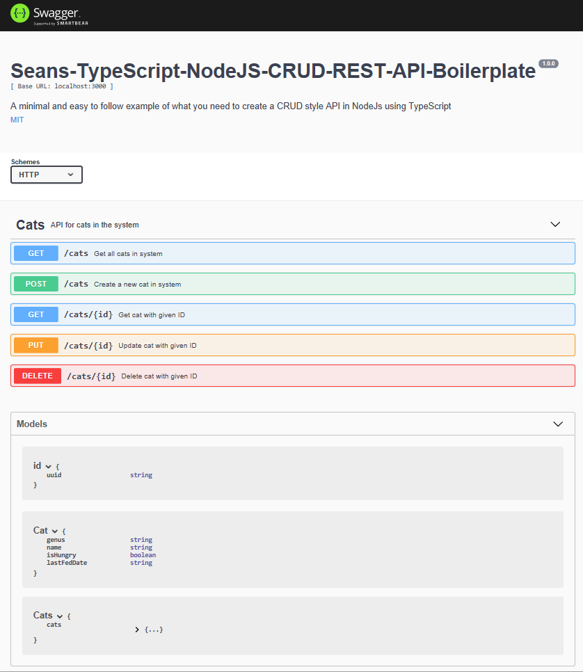
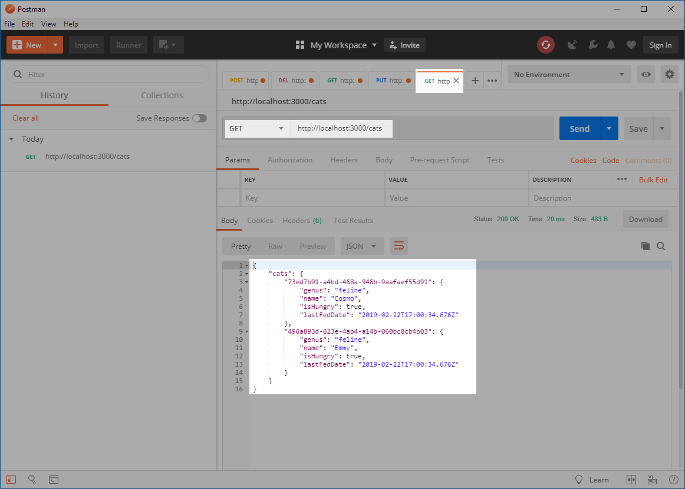
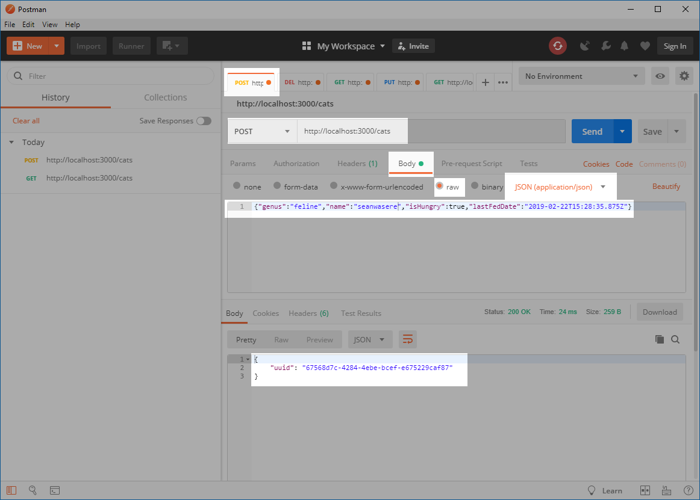
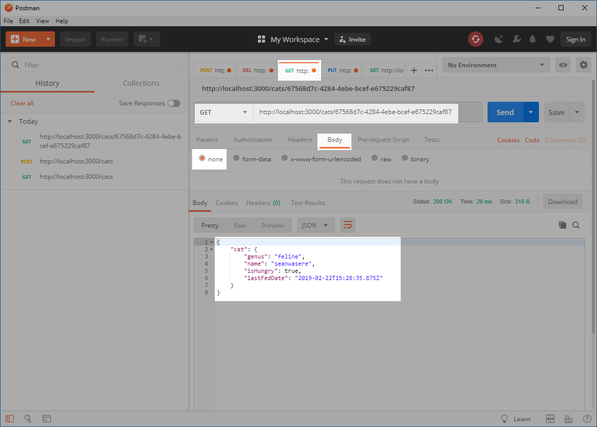
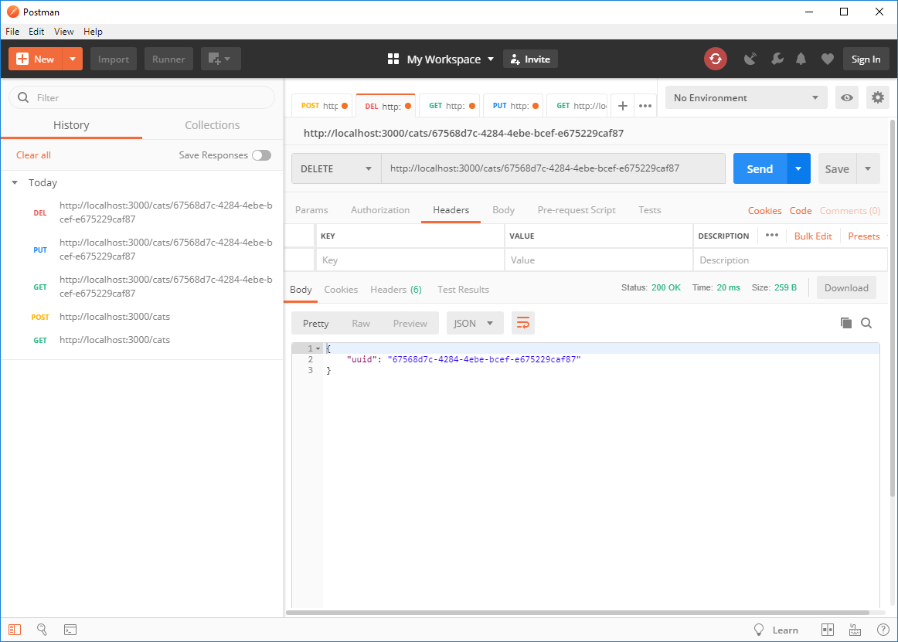

## Seans-TypeScript-NodeJS-CRUD-REST-API-Boilerplate 

> To help support this TypeScript boilerplate, please take a moment to look at my official TypeScript courses in <br/>  
   [Three.js and TypeScript](https://www.udemy.com/course/threejs-tutorials/?referralCode=4C7E1DE91C3E42F69D0F) and <br/>  
   [Socket.IO and TypeScript](https://www.udemy.com/course/typescript-socketio/?referralCode=2F6E227AC7EB9D147327)


### MIT License

Remember, No guarantees, or even fit for a particular purpose.

If you have a suggestion, or you want to contribute some code, you can make a pull request.

Your contributions will be visible since this project is public.

### Setup

```bash
npm install
```

### Development with nodemon and tsc --watch

```bash
npm run dev
```

Then visit `http://localhost:3000/cats`

### Run without nodemon and tsc --watch

```bash
npm start
```

Then visit `http://localhost:3000/cats`

## Swagger

Visit `http://localhost:3000/swagger` to view the OPENAPI document in Swagger-UI



### Video tutorial on setting up Swagger in an existing NodeJS TypeScript API
[](https://youtu.be/qemG0CWOx1I)

## Continuous Integration and Deployment
I've also added gitlab-ci.yml and dockerised with Docker-Compose. See video tutorial on how all this works.
[](https://youtu.be/Qlj6NiOy5jM)

## Heroku
You can also test this on heroku
https://seans-typescript-nodejs-crud.herokuapp.com/cats

and view the Swagger-UI
https://seans-typescript-nodejs-crud.herokuapp.com/swagger


[](https://heroku.com/deploy?template=https://github.com/Sean-Bradley/Seans-TypeScript-NodeJS-CRUD-REST-API-Boilerplate)

## Usage

### List all records



### Post (Create) Record



### Get by Id



### Put (Update) Record


### Delete Record


# TypeScript Courses

If you got this far, you probably like TypeScript just like I do,
I have created two TypeScript courses specializing in the [Three.js](https://www.udemy.com/course/threejs-tutorials/?referralCode=4C7E1DE91C3E42F69D0F) and [Socket.IO](https://www.udemy.com/course/typescript-socketio/?referralCode=2F6E227AC7EB9D147327)
 libraries that you may find useful.

## Threejs and TypeScript Course

[](https://youtu.be/BcF3yuVqfwo)

## Socket.io and TypeScript Course

[](https://youtu.be/3uLSNctzkkw)


